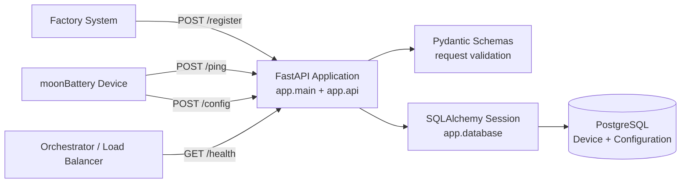
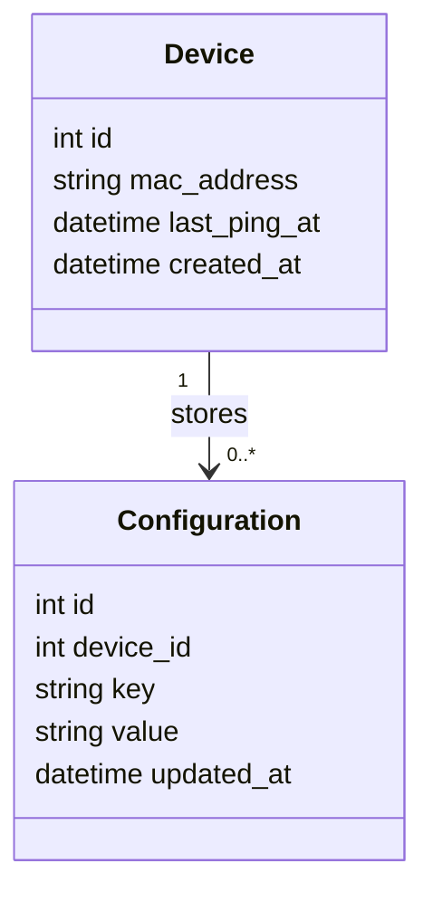
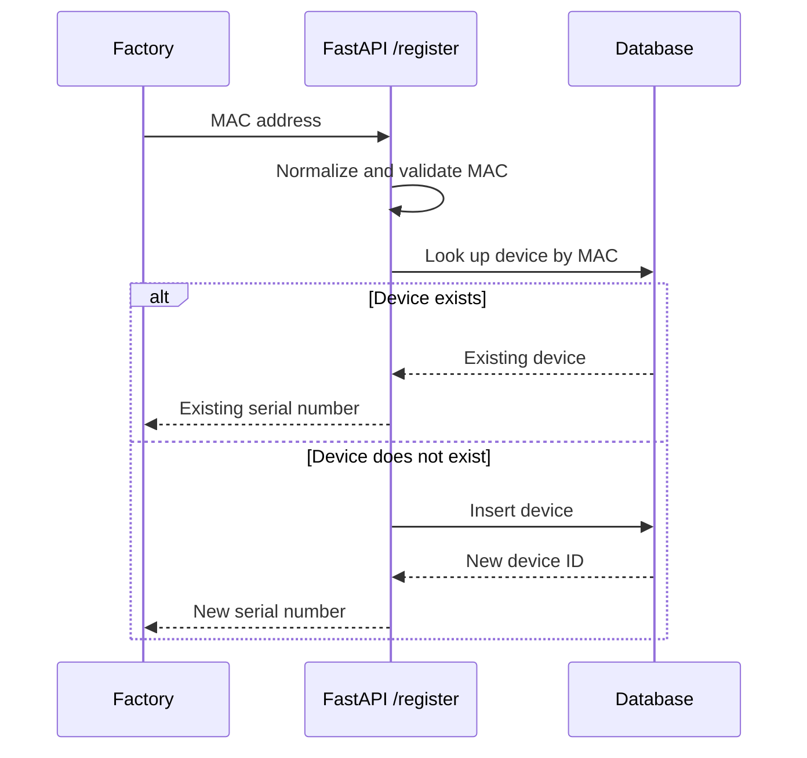
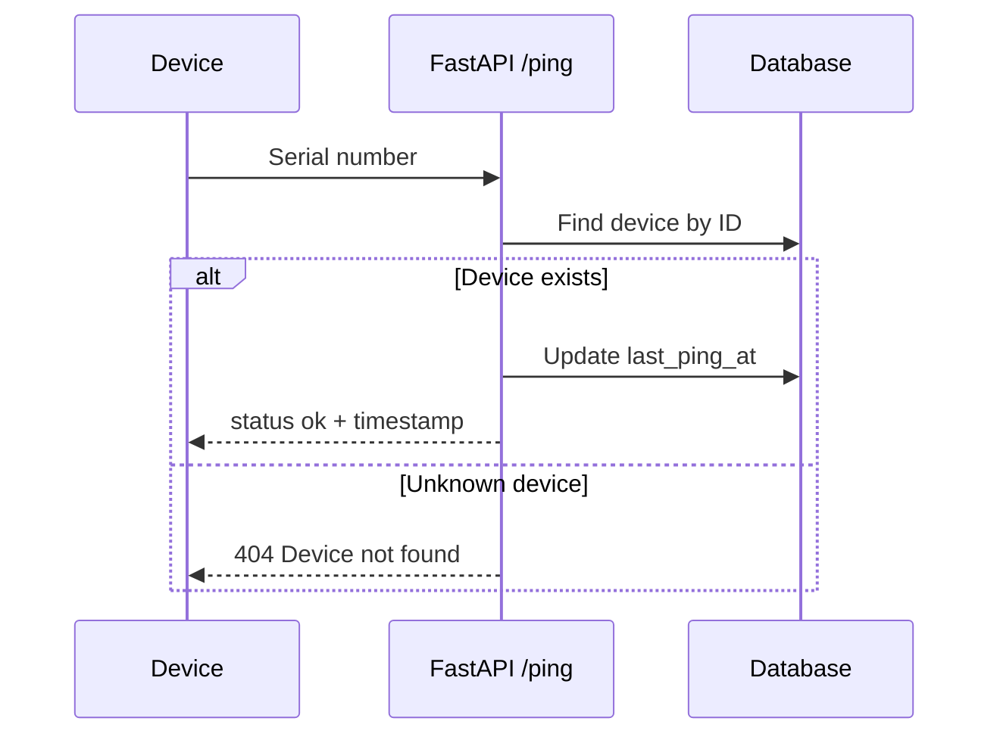
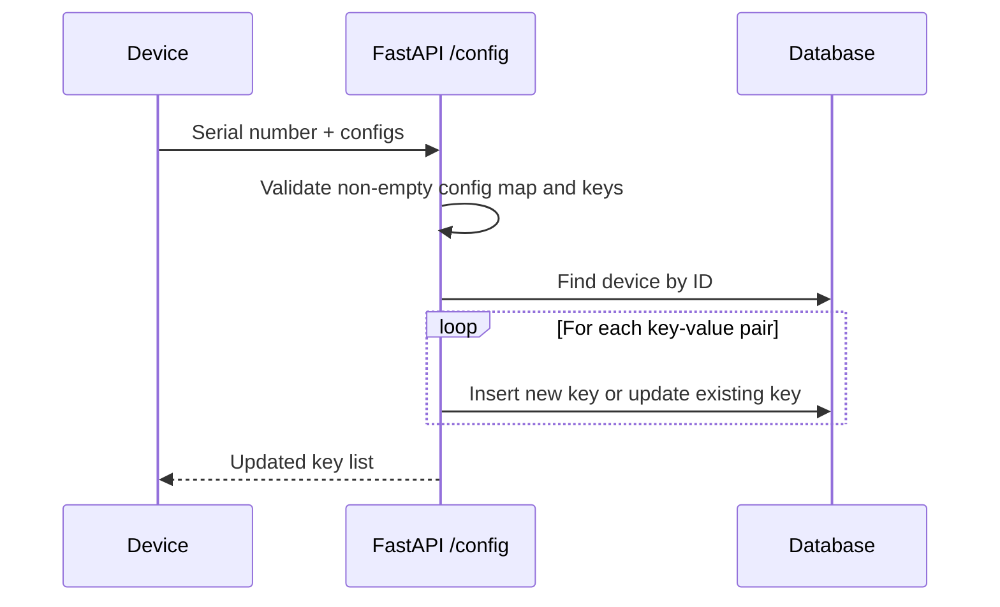

# moonBattery Requirements Traceability

This document extracts a simple requirement set from [coding-challenge-backend.md](coding-challenge-backend.md) and traces each requirement to design, code, and tests.

## Requirement Set

| ID | Requirement | Source |
| --- | --- | --- |
| R-01 | The backend shall register a moonBattery using its unique MAC address. | Challenge: Register endpoint |
| R-02 | The backend shall return a serial number after registration. | Challenge: Register endpoint |
| R-03 | Registering the same MAC address again shall not create a duplicate device. | Design decision for retry-safe production registration |
| R-04 | The backend shall reject invalid registration payloads. | Challenge: production-minded validation |
| R-05 | The backend shall accept a device ping by serial number. | Challenge: Ping endpoint |
| R-06 | The backend shall store the last contact time for a pinging device. | Challenge: Ping endpoint |
| R-07 | The backend shall reject pings for unknown devices. | Design decision for data integrity |
| R-08 | The backend shall accept one or more configuration key-value pairs. | Challenge: Configurations endpoint |
| R-09 | The backend shall create new configuration keys and update existing ones. | Design decision for simple device synchronization |
| R-10 | The backend shall reject empty or invalid configuration payloads. | Challenge: production-minded validation |
| R-11 | The project shall include setup and API documentation. | Challenge: README requirement |
| R-12 | The project shall document how endpoint communication should be secured. | Challenge: authentication bonus |
| R-13 | The project shall include automated tests for the required behavior. | Challenge: test your code |
| R-14 | The backend should expose a lightweight health endpoint for integration checks. | Operational readiness enhancement |

## Simple UML Design

### Component Diagram

### Class Diagram

### Register Sequence

### Ping Sequence

### Configuration Sequence

## Traceability Matrix

| Requirement | Design element | Code | Tests |
| --- | --- | --- | --- |
| R-01 | Register sequence, `Device` class | [RegisterRequest](app/api.py), [register](app/api.py), [Device](app/models.py) | [test_register_new_device](tests/test_api.py) |
| R-02 | Register sequence, `Device.id` as serial | [RegisterResponse](app/api.py), [register](app/api.py) | [test_register_new_device](tests/test_api.py) |
| R-03 | Register sequence existing-device branch | [register](app/api.py), unique `mac_address` in [Device](app/models.py) | [test_register_idempotent](tests/test_api.py) |
| R-04 | Pydantic validation | [RegisterRequest._validate_mac](app/api.py) | [test_register_invalid_mac](tests/test_api.py), [test_register_empty_body](tests/test_api.py), [test_register_mac_normalization](tests/test_api.py), [test_register_mac_dash_format](tests/test_api.py) |
| R-05 | Ping sequence | [PingRequest](app/api.py), [ping](app/api.py) | [test_ping_existing_device](tests/test_api.py) |
| R-06 | Ping sequence timestamp update | [ping](app/api.py), `last_ping_at` in [Device](app/models.py) | [test_ping_existing_device](tests/test_api.py), [test_ping_updates_timestamp](tests/test_api.py) |
| R-07 | Ping sequence unknown-device branch | [ping](app/api.py) | [test_ping_unknown_device](tests/test_api.py), [test_ping_invalid_serial](tests/test_api.py), [test_ping_empty_body](tests/test_api.py) |
| R-08 | Configuration sequence | [ConfigRequest](app/api.py), [update_config](app/api.py) | [test_config_create_keys](tests/test_api.py) |
| R-09 | Configuration insert/update loop | [update_config](app/api.py), [Configuration](app/models.py) | [test_config_create_keys](tests/test_api.py), [test_config_update_existing](tests/test_api.py), [test_config_persists_values](tests/test_api.py), [test_config_accepts_scalar_values](tests/test_api.py) |
| R-10 | Config validation and unknown-device branch | [ConfigRequest._validate_configs](app/api.py), [update_config](app/api.py) | [test_config_empty_configs](tests/test_api.py), [test_config_blank_key](tests/test_api.py), [test_config_rejects_long_key](tests/test_api.py), [test_config_missing_configs](tests/test_api.py), [test_config_unknown_device](tests/test_api.py) |
| R-11 | Documentation | [README.md](README.md), [coding-challenge-backend.md](coding-challenge-backend.md) | Reviewed manually |
| R-12 | Security documentation | [README.md](README.md) security section | Reviewed manually |
| R-13 | Automated tests | Test database fixtures and API tests | [tests/conftest.py](tests/conftest.py), [tests/test_api.py](tests/test_api.py) |
| R-14 | Health check | [health](app/api.py), Docker Compose app healthcheck | [test_health](tests/test_api.py) |

## Acceptance Criteria

| Requirement | Acceptance criteria |
| --- | --- |
| R-01/R-02 | `POST /register` with a valid MAC returns `201` and a numeric `serial_number`. |
| R-03 | Repeating `POST /register` with the same MAC returns the same `serial_number`. |
| R-04 | Invalid MAC or missing body returns `422`. |
| R-05/R-06 | `POST /ping` with a known serial returns `200`, `status: ok`, and a `last_ping_at` timestamp. |
| R-07 | `POST /ping` with an unknown serial returns `404`. |
| R-08/R-09 | `POST /config` with one or more pairs returns `200` and persists inserted or updated keys. |
| R-10 | Empty config maps, blank keys, missing fields, and unknown devices are rejected. |
| R-11/R-12 | README explains setup, endpoint usage, technology choices, and security approach. |
| R-13 | The test suite exercises all endpoint success and error paths above. |
| R-14 | `GET /health` returns `200` and `status: ok`. |

## Engineering Notes

- The API uses the database primary key as the device serial number. This keeps serial assignment atomic and avoids a second write after registration.
- The implementation is intentionally compact because the challenge has three core write endpoints. If this became a larger product, the next natural steps would be Alembic migrations, authentication middleware, and separate modules once the business logic grows.
- The tests run against SQLite in memory for speed, while Docker Compose runs the application against PostgreSQL for realistic local execution.
